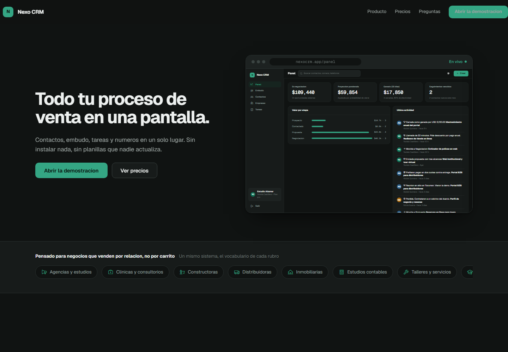

# Nexo CRM

CRM multi empresa en espanol para PyMEs. Contactos, embudo de ventas, tareas y
metricas en una sola pantalla. Sin dependencias, sin paso de compilacion.

> *A multi tenant CRM for small businesses, in Spanish. Vanilla HTML, CSS and
> JavaScript on the front, Cloudflare Workers and D1 on the back. No build step,
> no framework, no npm install.*

**Demostracion en vivo:** https://nexocrm-demo.vercel.app

No pide correo ni tarjeta. Entra con datos de una empresa ficticia para que se
vea como se siente el sistema lleno.



---

## Que demuestra este proyecto

**Aislamiento multi empresa hecho bien.** El identificador de la empresa nunca
viaja desde el navegador. Se deriva de la sesion en el servidor, en un unico
punto del codigo, y toda consulta a la base lleva `WHERE org_id = ?`. Es el error
clasico de los sistemas multi cliente y aqui esta resuelto por diseno, no por
disciplina.

**Una interfaz, dos motores de datos.** La misma aplicacion funciona sin servidor
(datos en el navegador, para la demostracion publica) o contra la API real. Se
cambia con una linea y la interfaz no sabe cual esta activo. Eso permite que la
demostracion publica no cueste nada de alojar y que nunca se desincronice del
producto, porque es el mismo codigo.

**La pagina de venta no usa capturas de pantalla.** Muestra la aplicacion real
corriendo dentro de un marco de navegador, escalada con `transform`. En la
seccion del embudo el visitante arrastra tarjetas de verdad sin registrarse.

**Seguridad integrada, no documentada.** Politica de contenido que prohibe
scripts en linea por completo, siete cabeceras de seguridad, contrasenas con
PBKDF2 y 210 mil iteraciones, limite de intentos, IP hasheadas y registro de
auditoria. Detalle completo en [SECURITY.md](SECURITY.md).

**Cero dependencias en el navegador.** Ni React, ni bundler, ni `node_modules`.
Cuatro archivos de JavaScript con modulos nativos. Se sube por FTP y funciona,
y no se rompe cuando una version de Node cambia en seis meses.

---

## Modulos

| Modulo | Que hace |
|---|---|
| Panel | Valor en negociacion, proyeccion ponderada por probabilidad, ganado del mes, efectividad de cierre, seguimientos vencidos y actividad reciente |
| Embudo | Tablero kanban. Las oportunidades se arrastran entre etapas y el total de cada columna se recalcula. Tambien se mueven con el teclado |
| Contactos | Listado con busqueda y ficha lateral con historial, oportunidades y tareas |
| Empresas | Agrupacion de contactos por cuenta |
| Tareas | Seguimientos con fecha, prioridad y responsable. Lo vencido sube al tope y se marca en rojo |

Ademas: modo claro y oscuro, version movil real, atajos de teclado en el embudo
y estados de carga, vacio y error en todas las vistas.

---

## Arquitectura

```
Pagina y aplicacion   HTML, CSS y JavaScript nativo, sin compilacion    Vercel
API                   Cloudflare Worker                                 serverless
Base de datos         Cloudflare D1 (SQLite), org_id en cada tabla      multi empresa
```

La capa de datos vive en [`public/js/store.js`](public/js/store.js) y expone una
sola interfaz con dos implementaciones:

```js
// Modo demostracion: todo en el navegador, sin servidor
const store = createStore();

// Modo produccion: la misma interfaz contra el Worker
window.NEXO_API = 'https://api.tudominio.com';
```

---

## Decisiones tecnicas que importan

**El dinero se guarda en centavos, como numero entero.** Nunca con decimales. Un
CRM que redondea mal los montos pierde la confianza del cliente el primer dia.

**Los campos a medida van en una columna JSON.** Cada rubro pide campos distintos
y alterar tablas por cliente no escala. Por eso existe la columna `custom` en
contactos, empresas y oportunidades.

**Las etapas del embudo son datos, no codigo.** Viven en la tabla `stages`, asi
una clinica puede tener "Evaluacion" y "Tratado" donde una agencia tiene
"Propuesta" y "Ganado", sin tocar una linea.

**Todo dato se escapa antes de tocar el HTML.** Via la funcion `esc()` de
[`public/js/ui.js`](public/js/ui.js). Un contacto llamado `<script>` se ve como
texto.

---

## Correr en local

No hay dependencias que instalar. Solo hace falta servir la carpeta `public` por
HTTP, porque el navegador bloquea los modulos de JavaScript en `file://`.

```bash
python -m http.server 4321 --directory public
```

Luego abre `http://localhost:4321`.

---

## Estructura

```
nexo-crm/
├── db/schema.sql          Esquema multi empresa para Cloudflare D1
├── worker/index.js        API: auth, contactos, empresas, embudo, tareas, metricas
├── wrangler.toml          Configuracion del Worker
├── vercel.json            Despliegue estatico y cabeceras de seguridad
├── SECURITY.md            Que esta protegido y como
├── public/
│   ├── index.html         Pagina de venta
│   ├── app.html           La aplicacion
│   ├── css/tokens.css     Unico archivo a tocar para cambiar de marca
│   ├── css/app.css        Interfaz de producto
│   ├── css/site.css       Pagina de venta
│   └── js/
│       ├── seed.js        Datos de la demostracion
│       ├── store.js       Capa de datos con los dos motores
│       ├── ui.js          Formato, plantillas seguras, avisos
│       ├── app.js         Enrutador y vistas
│       └── site.js        Comportamiento de la pagina de venta
└── docs/
    ├── PUBLICAR.md        Vercel y GitHub
    ├── DESPLIEGUE.md      La API en Cloudflare
    └── VENDER.md          Como revenderlo con otra marca
```

---

## Estado

Aplicacion completa y verificada en navegador, escritorio y movil. El esquema de
base de datos y la API estan escritos y listos para desplegar. La demostracion
publica ya esta en linea; la API de Cloudflare se despliega cuando haya clientes
con cuenta propia.

---

## Derechos

Copyright 2026 Ramses Adames. Todos los derechos reservados.

Codigo privado. No se concede licencia para usarlo, copiarlo, modificarlo ni
redistribuirlo, con fines comerciales o sin ellos. Si te interesa usarlo o
quieres verlo, escribe.

**Contacto:** WhatsApp [6378-5191](https://wa.me/50763785191) ·
[adamesramses999@gmail.com](mailto:adamesramses999@gmail.com)
